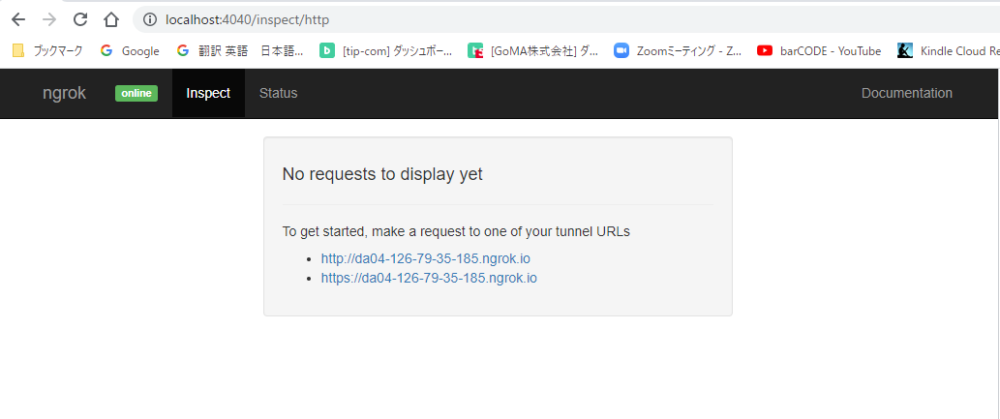

# ngrok導入手順

## docker-compose.ymlに追記
node:の次のブロックに下記を追加

```docker-compose.yml
    ngrok:
        container_name: ngrok
        image: wernight/ngrok:latest
        ports:
            - ${NGROK_PORT:-4040}:4040
        environment:
            NGROK_PORT: nginx:80
            NGROK_AUTH: 2GKecHxxxxxxxxx
```
※2GKecHxxxxxxxxx部分はアカウントを作成して受け取るキーなのでアカウントを作成する。

https://ngrok.com/

Your Authtokenにキーがある

docker-compose.ymlを書いたら

`docker-compose down`

`docker-compose up -d`

`docker-compose exec node npm install`

`docker-compose exec node npm run dev`

## ブラウザからアクセス

http://ドメイン:4040にアクセス



httpsの方をクリック.
必要ならアカウントを作成。


https://da04-126-79-35-185.ngrok.io/

にアクセスできる（da04-126-79-35-185部分は変化するのでLINE APIなどを利用する場合は都度エンドポイントを更新する）


